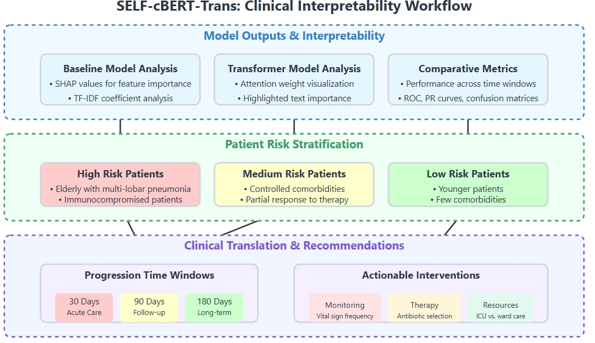
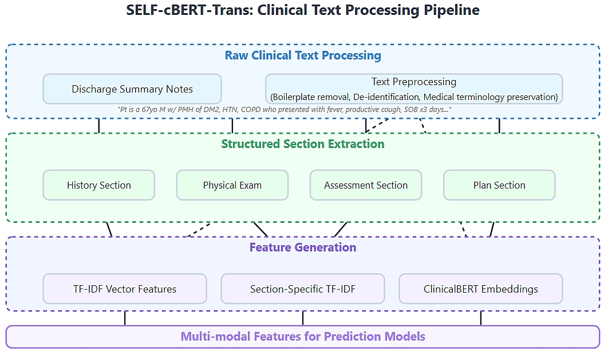
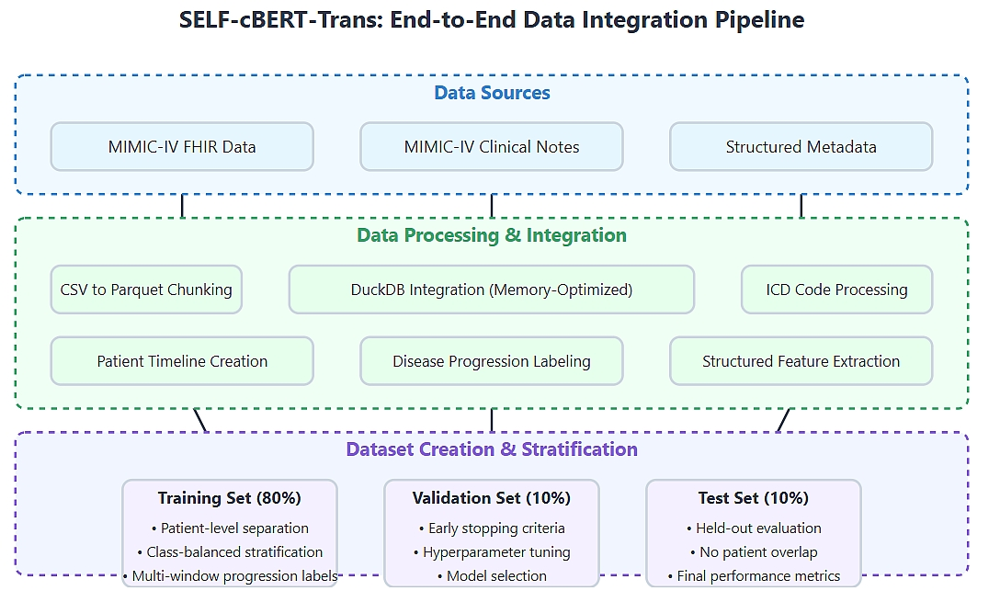
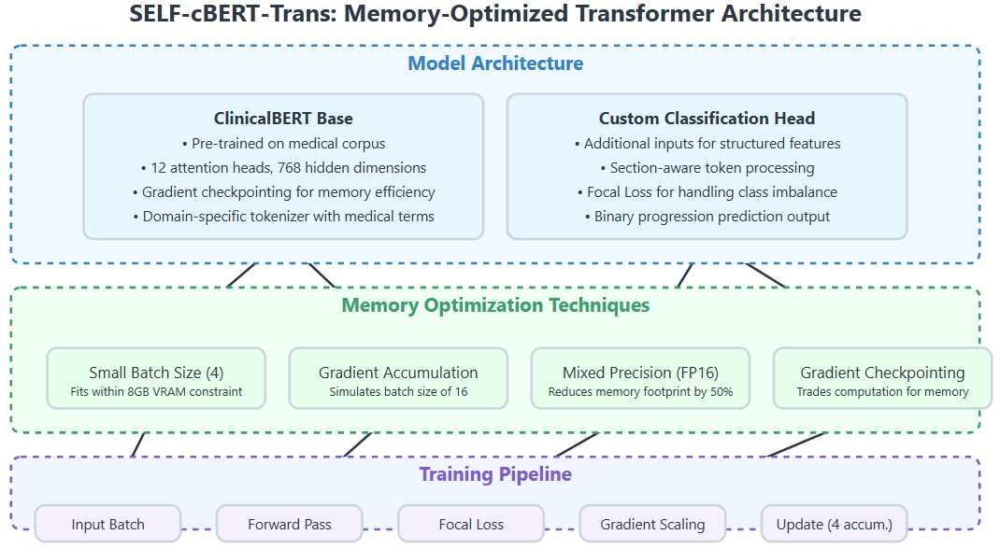
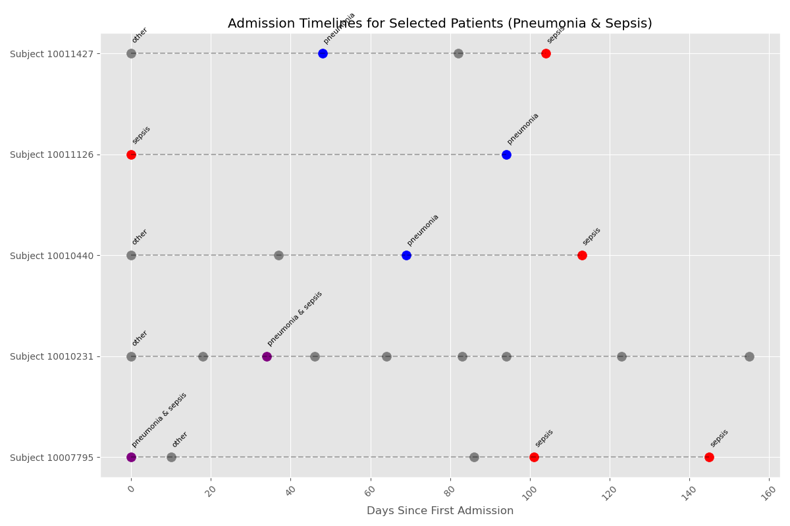

# Transformer-Based Disease Progression Prediction

## Abstract

Predicting disease progression remains a critical challenge in clinical decision support and risk stratification, demanding models capable of synthesizing complex patient histories from diverse data sources. This project introduces SELF-cBERT-Trans, a transformer-based framework that integrates ClinicalBERT to predict patient disease trajectories using discharge summaries and structured diagnosis codes (ICD-9 and ICD-10) from MIMIC-IV on FHIR. The model incorporates both free-text clinical narratives and structured diagnostic data to construct a comprehensive representation of patient health trajectories, improving the identification of high-risk individuals. Designed to detect patients at risk of developing secondary conditions based on prior admissions, the framework supports proactive medical interventions and enhances longitudinal patient management.

This approach advances traditional predictive modeling through the integration of context-rich clinical narratives and structured disease codes, providing a more holistic view of patient health status. ClinicalBERT embeddings extract latent signals from text, while structured ICD codes establish a validated foundation for labeling, maintaining consistency in disease tracking across multiple admissions. Model performance is assessed against conventional baselines such as TF-IDF + Logistic Regression, demonstrating the advantages of deep contextual embeddings. Additionally, SHAP interpretability and attention-weight analysis enhance transparency in decision-making, aligning model outputs with clinical reasoning and reinforcing trust in AI-driven risk stratification.

---

## Project Objectives

- **Develop a ClinicalBERT-based disease progression model** by integrating unstructured discharge summaries with structured ICD-9 and ICD-10 diagnoses.
- **Improve predictive accuracy and interpretability** by incorporating both textual embeddings and structured codes into a transformer-based framework.
- **Benchmark against classical baselines (TF-IDF + Logistic Regression)** to assess model efficacy.
- **Employ explainability techniques (SHAP, transformer attention weights)** to enhance interpretability for clinical adoption.
- **Provide a modular and scalable pipeline** for research reproducibility and real-world applicability in clinical settings.

---

## System Requirements and Dataset Considerations

### Code Execution and Hardware Considerations

The codebase provided in the `src` folder is designed for **local execution**, as it integrates data from **MIMIC-IV on FHIR** and **MIMIC-IV-Note: Deidentified Free-Text Clinical Notes**, both of which are **not publicly available**. Due to access restrictions, researchers must independently obtain dataset credentials via [PhysioNet](https://physionet.org/content/mimiciv/) to ensure compliance with its data use agreement (DUA).  

Additionally, the workflow is **optimized for local GPU execution**, leveraging **CUDA-accelerated computations** for ClinicalBERT fine-tuning and embedding generation. The total dataset size is approximately **2.2GB (compressed)**, while the integrated **DuckDB database (`mimic_integrated.duckdb`) expands to 2.86GB** after processing.  

For users without a local GPU, the following alternatives are recommended:  
- Google Colab (Pro): Provides GPU resources, but data must be manually uploaded.  
- CPU Execution: Modify transformer training scripts to reduce memory overhead, adjust batch sizes, and disable mixed precision (FP16).  

### Why MIMIC-IV? 
MIMIC-IV, published by the MIT Laboratory for Computational Physiology, was selected for its extensive coverage of real-world clinical settings and rich integration of structured and unstructured patient data. As the largest openly available ICU dataset, it enables deep learning applications in disease progression modeling:  
- Free-text clinical notes capture detailed narratives beyond structured EHRs.  
- Extensive ICU records support high-quality predictive modeling.  
- Pre-deidentified clinical notes ensure compliance with data privacy regulations.  

---

## Methodological Framework

### **1. Clinical Interpretability Workflow**
To ensure **clinically actionable insights**, the model's predictions are interpreted at multiple levels.

- **Baseline Model Analysis:** SHAP values reveal the most predictive textual features, while TF-IDF coefficients offer insights into term significance.
- **Transformer Model Analysis:** Attention weights highlight text segments influencing predictions, enhancing interpretability.
- **Comparative Metrics:** Model performance is evaluated across time windows using ROC curves, PR curves, and confusion matrices.

The model provides patient risk stratification into high-risk, medium-risk, and low-risk groups, enabling targeted interventions such as ICU prioritization, tailored therapy selection, and enhanced monitoring.

### **2. Clinical Text Processing Pipeline**
The **preprocessing pipeline** ensures that transformer models effectively utilize clinical text while preserving medically relevant information.

- **Raw Clinical Text Processing:** Discharge summaries undergo boilerplate removal, de-identification, and medical terminology preservation to optimize model input.
- **Structured Section Extraction:** Key sections—History, Physical Exam, Assessment, Plan—are identified for more granular processing.
- **Feature Generation:** Multi-modal features are created, including TF-IDF vectors, section-specific embeddings, and ClinicalBERT representations.

Structuring textual input allows the model to learn clinically meaningful patterns, improving its predictive accuracy and interpretability.  

### **3. End-to-End Data Integration Pipeline**
To merge structured ICD codes with free-text notes, a robust data integration pipeline is implemented.

- **MIMIC-IV FHIR Data & Clinical Notes** are merged using patient encounter references.
- **DuckDB Integration** enables efficient querying and dataset processing.
- **ICD Code Processing & Patient Timeline Creation** allow structured disease progression tracking.

Dataset stratification is designed to prevent data leakage and ensure robust evaluation:
- **Training Set (80%)**: Patient-level separation with multi-window progression labeling.
- **Validation Set (10%)**: Used for early stopping and hyperparameter tuning.
- **Test Set (10%)**: Ensures held-out evaluation with no patient overlap.

### **4. Memory-Optimized Transformer Implementation**
Due to computational constraints, the transformer architecture is optimized for efficient training and inference.

- **ClinicalBERT Base:** Pre-trained on a medical corpus with 12 attention heads and 768 hidden dimensions, optimized for clinical narratives.
- **Custom Classification Head:** Incorporates structured ICD features** and section-aware token processing.
- **Memory Optimization Techniques:**
  - **Gradient Accumulation & Checkpointing:** Enables batch size scaling while maintaining memory efficiency.
  - **Mixed Precision (FP16):** Reduces memory footprint by 50%, improving training scalability.
  - **Focal Loss Implementation:** Adjusts class imbalance dynamically, focusing learning on rare disease progression cases.

---

## Time-Series Insights into Pneumonia-to-Sepsis Progression

  

This visualization presents the health trajectories of selected patients, mapping their progression from pneumonia to sepsis over multiple hospital admissions. Each horizontal line represents a patient, with hospital visits plotted along the x-axis as days since their first admission. Color-coded markers indicate different diagnoses and reveal patterns where patients initially hospitalized with pneumonia (blue) later develop sepsis (red). Cases where pneumonia and sepsis appear together (purple) suggest critical illness at admission. This figure illustrates the project's main goal—ClinicalBERT embeddings and structured ICD-10 codes help identify high-risk patients early, giving clinicians the opportunity to intervene before severe complications develop.

---

## Ethical Considerations and Data Usage

This research adheres to MIMIC-IV Data Use Agreements (DUA) to ensure patient privacy and compliance with regulatory guidelines. No patient data is shared in this repository, and all data must be accessed through PhysioNet under controlled conditions.

- **Data cannot be publicly distributed** due to de-identification constraints.
- **Model outputs must be used responsibly** to prevent biased or misleading clinical applications.
- **Researchers must obtain MIMIC-IV access independently** to replicate results.

For dataset access and compliance, refer to the [PhysioNet MIMIC-IV database](https://physionet.org/content/mimiciv/).

---

## References

The following works influenced the development of methodologies and model selection employed in this project:

- Alsentzer, E., Murphy, J., Boag, W., Weng, W. H., Jin, D., Naumann, T., & McDermott, M. (2019). ClinicalBERT: Modeling clinical notes and predicting hospital readmission. *arXiv preprint arXiv:1904.05342.* https://arxiv.org/abs/1904.05342

- Rasmy, L., Xiang, Y., Xie, Z., Tao, C., & Zhi, D. (2021). Med-BERT: Pre-trained contextualized embeddings on large-scale structured electronic health records for disease prediction. *NPJ Digital Medicine, 4*(1), Article 86. https://doi.org/10.1038/s41746-021-00455-y

- Choi, E., Bahadori, M. T., Searles, E., Coffey, C., & Sun, J. (2016). Multi-layer representation learning for medical concepts. *Proceedings of the 22nd ACM SIGKDD International Conference on Knowledge Discovery and Data Mining (KDD '16)*, 1495–1504. https://doi.org/10.1145/2939672.2939823

---

## License
This project is released under the MIT License.
Note: Access to MIMIC-IV data requires PhysioNet approval, and any derived datasets must adhere to PhysioNet's data-sharing policies.